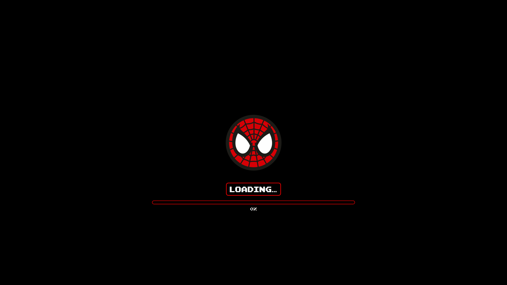

# 🕷️ Spider-Man Splash Screen
*A Spider-Man themed KDE Plasma 6 splash screen featuring the classic red & blue color palette. Fork of Styrup Jazz Animated Splash.*



---

## ✨ Features
- **Spider-Man classic theme** with iconic red & blue colors
- **Pure black background** for dramatic contrast
- **Smooth animations** inherited from original jazz theme
- **Pixel-perfect Loading** text and animated progress bar
- **Bitmap-style font** Pixel Emulator
- **Web-slinging vibes** for your daily KDE startup

---

## 🚀 Installation

### Method 1: KDE Store *(Recommended)*
1. **Visit the KDE Store**: [Spider-Splash on Pling](https://www.pling.com/p/2316665/)
2. **Click "Install"** or download the package
3. **Activate** in System Settings > Appearance > Splash Screen > **Spider-Splash**
4. **Log out & back in** (or restart Plasma) to see your friendly neighborhood splash screen

### Method 2: Manual Installation
1. **Download** the latest release or clone this repository
2. **Copy the package** folder into your Plasma look-and-feel directory:
   ```bash
   cp -r spider-man_splash_animated ~/.local/share/plasma/look-and-feel/
   ```
3. **Activate** in System Settings > Appearance > Splash Screen > **Spider-Splash**
4. **Log out & back in** *(or restart Plasma)* to see your friendly neighborhood splash screen

#### 🎨 Customization
##### Color Palette *(Line 33)*
The Spider-Man color palette is defined in the theme properties:
  ```qml
    // Theme colors
    property var theme: ({
        primary: "#D80000",
        secondary: "#000000",
        text: "#FEFEFE",
        border: "#D80000",
        accent: "#0047AB",
        win95teal: "#008080"
    })
  ```
##### Loading Text Messages *(Line 169)*
💡 **Quick Setup**: Pre-translated versions are available in Releases for English and Spanish !
Customize the loading messages for different languages *(Default in French)*:
   ```qml
      // Plasma-specific stage handling
onStageChanged: {
    switch (stage) {
        case 1:
            loadingText.text = "Initialisation...";        // Change to your language
            root.progress = 0.2;
            break;
        case 2:
            loadingText.text = "Chargement des Spider-Services...";  // Loading Spider-Services
            root.progress = 0.4;
            break;
        case 3:
            loadingText.text = "Démarrage de Spider-Desktop...";     // Starting Spider-Desktop
            root.progress = 0.6;
            break;
        case 4:
            loadingText.text = "Préparation...";           // Preparing
            root.progress = 0.8;
            break;
        case 5:
            loadingText.text = "Prêt";                     // Ready
            root.progress = 1.0;
            break;
    }
}
   ```

#### 📄 License
This package is **dual-licensed**:

- **QML code & helper scripts**
GNU GPL v3 (or later)
Full text
- **Images & fonts**
CC BY-SA 4.0 International
Full text

See **LICENSE** for full details.

#### 🙏 Credits

- **Original Code & Concept**: Jim Sines - raystanza@raystanza.uk
- **Spider-Man Fork**: SAWKIT - sawkit17@icloud.com
- **Original Project**: Styrup Jazz Animated Splash


#### 🐛 Issues & Contributing
Found a bug or want to contribute? Feel free to:

- Open an issue on GitHub
- Submit a pull request
-- Suggest new Spider-Man variants (Miles Morales, Spider-Gwen, etc.)


With great power comes great splash screens! 🕸️
